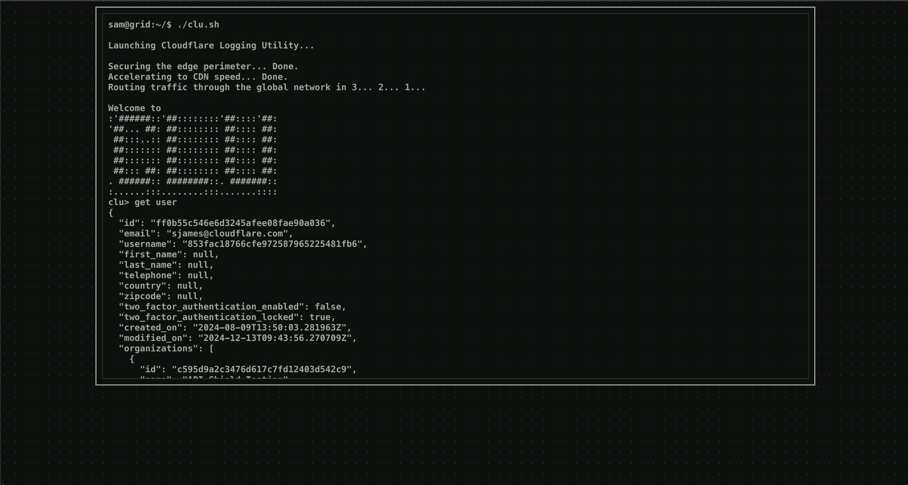

# Cloudflare Logging Utility

## WIP Several improvments and evals incoming 

CLU is a pet project. It tries to build a CLI client for Cloudflare's API. Using AI :)

If you want to test it out, you can see it here [clu.defo.works](https://clu.defo.works/). For now, you need to add a [read-only API token](https://dash.cloudflare.com/profile/api-tokens). You will be shown a message on how to do this once you open the terminal.

### Don't worry, your tokens are safe. You can read the code if you'd like, but if you're still concerned just deploy this yourself. You gotta pay for the GPUs tho.

